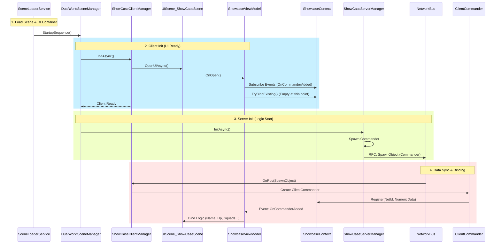

# Loading Sequence and Data Binding Report

## 1. Overview

The loading process of the entire scene involves sequential triggering with parallel execution. The core mechanism is that **SceneLoaderService** drives **DualWorldSceneManager**, which in turn coordinates the startup order of the **Client** (UI and Presentation) and the **Server** (Logic and Data).

**Key Principles**:

1. **Client First**: The client manager starts first, loads the UI, and establishes event listeners. At this point, there is no game data, so the UI is in an "idle and waiting" state.
2. **Server Second**: The server/logic manager starts afterwards and begins spawning entities (Commanders/Squads).
3. **Reactive Binding**: Once data is generated, it is synchronized to the client via the network layer, registered into the Data Layer (`Context`), and triggers events to notify the UI for binding.

---

## 2. Detailed Sequence Diagram

---

## 3. Step-by-Step Analysis

### 3.1 Scene Loading & Dependency Injection

- **Entry Point**: `SceneLoaderService.LoadSceneAsync`.
- **Operation**: Instantiates the `GameObjectContext` configured in `ShowcaseInstaller`.
- **Result**: All Managers (`DualWorld`, `Server`, `Client`), Data Layer (`ShowcaseContext`), and Logic Layer (`ShowcaseViewModel`) are created and injected. At this moment, `ShowcaseContext` is empty.

### 3.2 Client Initialization

- **Code**: `DualWorldSceneManager.StartupSequence()` -> `_clientManager.InitAsync()`.
- **UI Loading**: `ShowCaseSceneClientManager` calls `UIManager.OpenUIAsync` to load `UIScene_ShowCaseScene`.
- **ViewModel Activation**:
  - When UI opens, `ViewModel.OnOpen()` is called.
  - `ShowcaseViewModel` immediately subscribes to `ShowcaseContext` events.
  - `ShowcaseViewModel` attempts `TryBindExisting()`, but since the Server hasn't run yet and the Context is empty, the **interface displays as blank (or default values)**.

### 3.3 Server Initialization

- **Code**: `DualWorldSceneManager.StartupSequence()` -> `_serverManager.InitAsync()`.
- **Entity Spawning**: `ServerRoomManager` creates the `ServerCommander` entity.
- **Network Sync**: After `ServerCommander` is initialized, it sends an `RpcSpawnObject` command via the `SimulatedNetworkBus`.

### 3.4 Data Registration & Response (Data Flow)

- **Client Receipt**: `ClientRoomManager` receives the RPC and creates the `ClientCommander`.
- **Data Registration**: After initializing its `NumericComponent`, `ClientCommander` calls `ShowcaseContext.Register()`.
- **Data Dispatch**:
  - `ShowcaseContext` stores data in its dictionary.
  - **Critical Point**: `ShowcaseContext` triggers the `OnCommanderAdded` event.
- **UI Response**:
  - `ShowcaseViewModel` receives the event.
  - Calls `PlayerInfo.BindData(commander)`.
  - UI refreshes to display Commander name, HP, Squad list, etc.

## 4. FAQ

**Q: Why was no data displayed when I reloaded the UI previously?**
A: This references the issue you encountered earlier. When reloading the UI, Server initialization is **already complete**, so no new RPCs are sent. The UI relies on `TryBindExisting()` within `ShowcaseViewModel.OnOpen`. If the previous data registration failed to correctly write to the query dictionary (e.g., `_factionMap`), `TryBindExisting` would fail. Our recent fix ensures this data integrity.

**Q: Why is data registered in ClientCommander instead of being created in the Context directly?**
A: We follow the **"Data Follows Entity"** principle. The network entity (`ClientCommander`) holds the latest state data. The Context is merely a **passive data index container**. This design decouples lifecycle management—when an entity is destroyed, it automatically unregisters its data, ensuring the Data Layer always reflects the current state of the game world.
