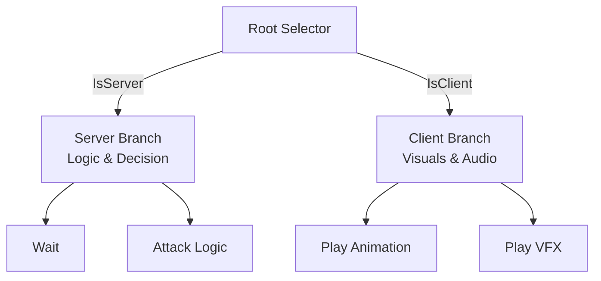

## Problem Context

In a "Dual World" architecture, although the Server and Client share the same codebase, their responsibilities in behavior representation are distinct:

1. **Server**: Responsible for core decision-making, state changes, and numerical calculations (e.g., damage taking, death verification).
2. **Client**: Responsible for visual presentation, sound effects, animation playback, and UI display.

If we maintain two separate behavior trees (`ServerTree` and `ClientTree`), it doubles the maintenance cost and introduces the risk of logic inconsistencies. If we let the Client run the exact same logic as the Server, it not only wastes performance but can also lead to "Split-Brain" issues and state desynchronization due to floating-point errors or timing differences.

How can we satisfy the different needs of both ends within a single behavior tree asset while maintaining strict server authority?

## Previous Logic / Alternatives

1. **Complete Separation**: Creating `Soldier_Server.asset` and `Soldier_Client.asset`.
    - *Drawback*: Modifying a single logic (like adding an "Attack" state) requires editing two files, making it easy to miss updates.
2. **Complete Mirror**: The Client runs the exact same tree, only skipping the final "Apply Damage" step.
    - *Drawback*: The Client needs to perform complex decision-making calculations; it's easy for the Client to decide to attack while the Server decides not to (due to slight distance differences), resulting in the Client playing an attack animation but dealing no damage, causing a disjointed experience.

## Solution

We adopt an **"Isomorphic Tree + Root Selector + Blackboard Synchronization"** architecture.

### 1. Root Selector

The root node of the entire tree is a special Selector that decides which branch to enter based on the runtime `Context.IsServer` value:

- **Server Branch**: Contains full decision logic (AI pathfinding, target acquisition, attack verification). This is the "Brain".
- **Client Branch**: Contains purely presentational logic (play attack animation, play VFX). This is the "Body".

### 2. Blackboard Synchronization

The Client Branch is **strictly forbidden** from making any independent decisions (such as "is distance close enough"). Its execution relies entirely on data in the **Blackboard**, which is written by the Server Branch and synchronized over.

- **Writer**: Server Branch. For example, when the Server decides to "Attack", it not only executes the attack logic but also modifies the Blackboard Key `IsAttacking = true`, or `ActionState = Attacking`.
- **Sync Mechanism**: The Server sends critical Keys marked for synchronization (e.g., State, TargetID) to the Client every frame (or on demand).
- **Reader**: Client Branch. Client nodes (e.g., `CheckBlackboardCondition`) read these values. If `IsAttacking == true`, it enters the node to play the attack animation.

### 3. Protocol and Timing

To ensure smooth and correct presentation:

1. **Key Naming Convention**: Share the same set of Key definitions (e.g., `BB_Key_TargetId`).
2. **Message Structure**:
    - `SyncBlackboardMessage`: Contains `Dict<string, BBValue>`.
    - It is recommended to carry a `Tick` or `Version` to prevent out-of-order execution.
3. **Interpolation and Prediction**: For position information, the Client still uses smooth interpolation (View) rather than snapping to the position in the behavior tree blackboard.

### 4. Architectural Advantages

- **Unified Asset**: Designers only need to work on one canvas, making the relationship between logic and presentation clear at a glance.
- **Single Authority**: The Client makes zero decisions, acting only as a "Shadow Clone" of the Server, completely eliminating the risk of logic desynchronization.
- **Easy Debugging**: You can observe Server and Client blackboard values simultaneously in the editor to quickly pinpoint if it's a "sync failure" or a "playback failure".
- **WYSIWYG**: You can directly mount VFX and SFX nodes in the behavior tree, maintaining architectural consistency.
