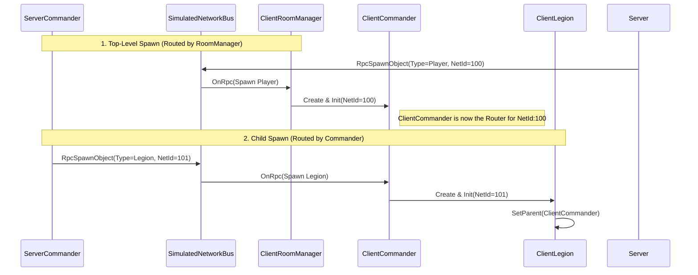

# Network Architecture Refactor: Centralized Dispatch & Commander Hierarchy

## 1. Context

In the early stages of development, our network object spawning logic was scattered. The `ClientRoomManager` was responsible for listening to all network spawn events and attempting to assemble various game objects. With the introduction of the hierarchical structure required by SLG gameplay (Commander -> Legion -> Squad -> Unit), this flattened spawning approach revealed several issues:

1. **Listener Hell**: Every network object required manual registration of RPC listeners, leading to frequent omissions and bugs.
2. **Hierarchy Confusion**: `ClientRoomManager` had to manually maintain ID mappings to reconstruct parent-child relationships, resulting in complex and fragile logic.
3. **Timing Issues**: There was no guarantee that a parent object (e.g., Commander) would be fully initialized before its child object (e.g., Legion) arrived.

We needed a more robust network architecture that adheres to the "Server-Authoritative" model and supports deep object hierarchy spawning.

## 2. Decision

We decided to implement the **Centralized Dispatch** and **Commander-Centric Spawning** patterns.

### 2.1 Centralized Dispatch

We introduced the concept of a **Router**. Network messages are no longer broadcasted blindly but are received and dispatched by specific "Router" objects.

- **Root Router (`ClientRoomManager`)**:
  - Listens to a static ID (`ROOM_MANAGER_NET_ID`).
  - **Responsibility**: Handles only top-level object spawning (e.g., `Player/Commander`).
  - It acts as a filter, ignoring non-top-level objects (e.g., `Legion`), delegating them to lower-level routers.

- **Secondary Router (`ClientCommander`)**:
  - Listens to the dynamic NetId assigned to it by the Server.
  - **Responsibility**: Handles the spawning of child objects belonging to it (e.g., `Legion`).

### 2.2 Auto-Wiring

We enhanced the `RegisterSpawns` method in `SimulatedNetworkBus`.

- **Decision**: When registering a network object, its `OnRpc` method is automatically registered as a listener for that NetId by default.
- **Benefit**: Developers only need to call register once to ensure the object receives all messages directed to its NetId, eliminating manual registration errors.

## 3. Details & Implementation

### 3.1 Core Sequence Flow



### 3.2 Key Code Changes

**ClientRoomManager.cs**:

```csharp
public override void OnRpc(IRpc rpc)
{
    if (rpc is RpcSpawnObject spawnMsg && spawnMsg.Type == NetworkPrefabType.Player)
    {
        // Only handle Commander spawning
        OnSpawnObject(spawnMsg);
    }
    // Ignore Legion/Squad, handled by ClientCommander
}
```

**ClientCommander.cs**:

```csharp
public override void OnRpc(IRpc rpc)
{
    if (rpc is RpcSpawnObject spawnMsg && spawnMsg.Type == NetworkPrefabType.Legion)
    {
        // Received message addressed to self, requesting to spawn child Legion
        var legion = _legionFactory.Create();
        // ... Init and Register ...
    }
}
```

## 4. Summary

This refactor establishes a clear **Server -> Client Router -> Sub-Router** hierarchy by delegating network message dispatching. This not only resolves code coupling issues but also naturally ensures the correctness of complex SLG object hierarchies during network synchronization.
