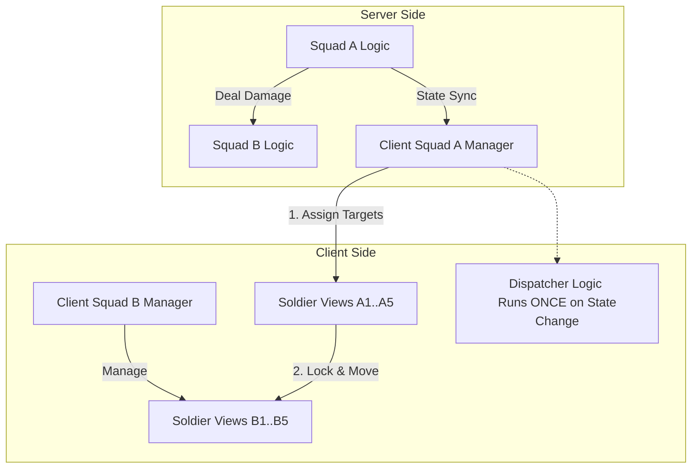

## 1. Problem Background

In mass-battle SLG games like *Whiteout Survival*, the combat visuals are often highly detailed:

- **Independent Soldier Behavior**: Each soldier seems to have their own "mind," locking onto enemies, charging, and attacking specific targets.
- **High Fidelity**: Frontline soldiers prioritize finding the nearest enemy units to engage with, rather than slashing at empty air.

However, technically implementing an independent AI behavior tree (pathfinding, target seeking, decision making) for every single soldier (e.g., 10,000 units on each side) would face massive performance bottlenecks:

1. **CPU Explosion**: Updating the behavior logic for tens of thousands of agents every frame is unrealistic on mobile devices.
2. **Network Synchronization Difficulties**: Synchronizing the position and status of every soldier would consume unbearable amounts of bandwidth.

Therefore, we need an architecture that maintains the simplicity and high performance of macro combat logic while presenting the high fidelity of micro soldier combat.

## 2. Previous Logic & Misconceptions

Initial intuitive designs often fall into these traps:

- **Misconception**: Thinking that "independent soldier targeting" means a Behavior Tree is attached to every soldier.
- **Misconception**: Thinking the server needs to know the position of every soldier for precise determination.

This design violates the principle of **Logic-View Separation**, leading to excessive server load and difficulties in client-side optimization.

## 3. Proposed Solution: Central Dispatcher & View Layer Proxy

We adopt an architecture of **"Squad-Level Logic + View Layer Target Allocation"**.

### 3.1 Core Principles

1. **Server Authoritative - Squad Only**
    - The server only maintains objects at the **Squad (Formation/Legion)** level.
    - Combat calculations are abstract: Squad A deals 1000 damage to Squad B per turn.
    - The server is **completely unaware** of the soldiers' existence and does not care about their positions.

2. **Client Visual - Visual Proxy**
    - To "sell the illusion," the client generates N **Soldier Views** (visual soldiers) based on the Squad's state.
    - These soldiers have no "brain," only a "command receiver."

### 3.2 Key Mechanism: The Pairing Algorithm

To achieve the effect of "seemingly independent intelligence," we implement a **Central Dispatcher** at the client Squad View layer.

**The Process:**

1. **State Sync**: The server notifies the client that `Squad A` has entered the `Attack` state, targeting `Squad B`.
2. **Target Allocation (The Pairing)**:
    - The Client `Squad A View` iterates through all its visual soldiers.
    - It retrieves all visual soldiers from the enemy `Squad B View`.
    - It runs a lightweight algorithm (like nearest neighbor or random slot matching) to assign a specific `Soldier B` as the `LockTarget` for each `Soldier A`.
3. **Pseudo-AI Execution**:
    - `Soldier A` receives the command: "Go slash `Soldier B`".
    - `Soldier A` executes extremely simple logic: `MoveTo(B.Position)` -> `PlayAnim("Attack")`.
    - **Synchronized Hit**: When A plays the attack impact frame, it directly notifies B to play the hit reaction, ensuring visual synchronization.

### 3.3 Architecture Diagram

## 4. Benefits

1. **High Performance**: The logic layer complexity is O(SquadCount), independent of the soldier count.
2. **Strong Visual Expressiveness**: Through the client-side "pairing," we achieve visceral combat visuals, avoiding "fighting air."
3. **Development Decoupling**:
    - The server focuses on numerical verification and win/loss determination.
    - The client focuses on animation blending, special effects, and "game feel," without interfering with each other.

## 5. Conclusion

All "independent soldier AI" in large-scale SLG battles is a **visual deception**.
The real Behavior Tree exists only at the **Squad** level. Soldiers are merely **View Components** of the presentation layer, with their behavior completely **deterministically allocated** by the upper-level Squad Manager.
