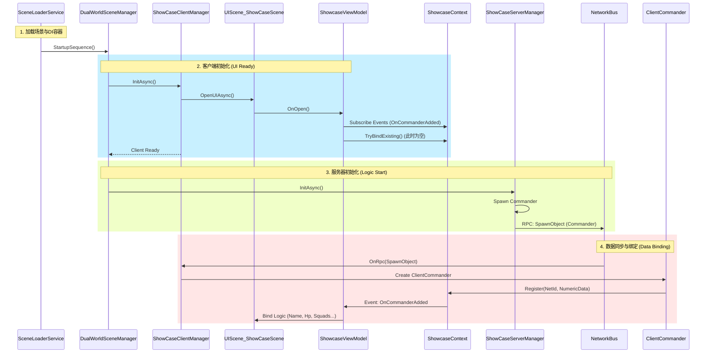

# 工程加载与数据绑定流程报告

## 1. 核心流程概述

整个场景的加载是一个串行触发、并行执行的过程。核心在于 **SceneLoaderService** 驱动 **DualWorldSceneManager**，进而协调 **Client**（UI与表现）与 **Server**（逻辑与数据）的启动顺序。

**关键原则**：

1. **UI 先行 (Client First)**：客户端管理器先启动，加载 UI 并建立事件监听。此时还没有业务数据，UI 处于“空载并等待”状态。
2. **逻辑后至 (Server Second)**：服务器/逻辑管理器后启动，开始生成实体（Commander/Squad）。
3. **响应式绑定 (Reactive Binding)**：数据产生后，通过网络层同步到客户端，注册到数据层 (`Context`)，并触发事件通知 UI 进行绑定。

---

## 2. 详细时序流程图

---

## 3. 步骤详细解析

### 3.1 场景加载与依赖注入 (Dependency Injection)

- **入口**: `SceneLoaderService.LoadSceneAsync`。
- **操作**: 实例化 `ShowcaseInstaller` 配置的 `GameObjectContext`。
- **结果**: 所有 Manager (`DualWorld`, `Server`, `Client`)、Data Layer (`ShowcaseContext`)、Logic Layer (`ShowcaseViewModel`) 被创建并注入依赖。此时 `ShowcaseContext` 是空的。

### 3.2 客户端启动 (Client Initialization)

- **代码**: `DualWorldSceneManager.StartupSequence()` -> `_clientManager.InitAsync()`。
- **UI 加载**: `ShowCaseSceneClientManager` 调用 `UIManager.OpenUIAsync` 加载 `UIScene_ShowCaseScene`。
- **ViewModel 激活**:
  - UI 打开时调用 `ViewModel.OnOpen()`。
  - `ShowcaseViewModel` 立即订阅 `ShowcaseContext` 的事件。
  - `ShowcaseViewModel` 尝试 `TryBindExisting()`，但因为此时 Server 还没跑，Context 里什么都没有，所以**界面显示为空白（或默认值）**。

### 3.3 服务器启动 (Server Initialization)

- **代码**: `DualWorldSceneManager.StartupSequence()` -> `_serverManager.InitAsync()`。
- **实体生成**: `ServerRoomManager` 创建 `ServerCommander` 实体。
- **网络同步**: `ServerCommander` 初始化后，通过 `SimulatedNetworkBus` 发送 `RpcSpawnObject` 指令。

### 3.4 数据注册与响应 (Data Flow)

- **Client 接收**: `ClientRoomManager` 收到 RPC，创建 `ClientCommander`。
- **数据注册**: `ClientCommander` 在初始化其 `NumericComponent` 后，调用 `ShowcaseContext.Register()`。
- **数据分发**:
  - `ShowcaseContext` 将数据存入字典。
  - **关键点**: `ShowcaseContext` 触发 `OnCommanderAdded` 事件。
- **UI 响应**:
  - `ShowcaseViewModel` 收到事件。
  - 调用 `PlayerInfo.BindData(commander)`。
  - UI 刷新，显示指挥官名字、血量、Squad 列表等。

## 4. 常见问题 (FAQ)

**Q: 为什么我重新加载 UI 时无法显示数据？**
A: 这是您之前遇到的问题。重新加载 UI 时，Server 初始化**已完成**，不会再发 RPC。此时依赖 `ShowcaseViewModel.OnOpen` 中的 `TryBindExisting()`。如果之前的数据注册未能正确写入查询字典（如 `_factionMap`），`TryBindExisting` 就会失败。我们之前的修复保证了这一点。

**Q: 为什么是在 ClientCommander 中注册数据，而不是在 Context 里自建？**
A: 遵循 **"数据跟随实体"** 原则。网络实体 (`ClientCommander`) 拥有最新的状态数据。Context 只是一个**被动的数据索引容器**。这样设计解耦了生命周期管理——实体销毁时自动注销数据，确保数据层永远反映当前游戏世界的真实状态。
