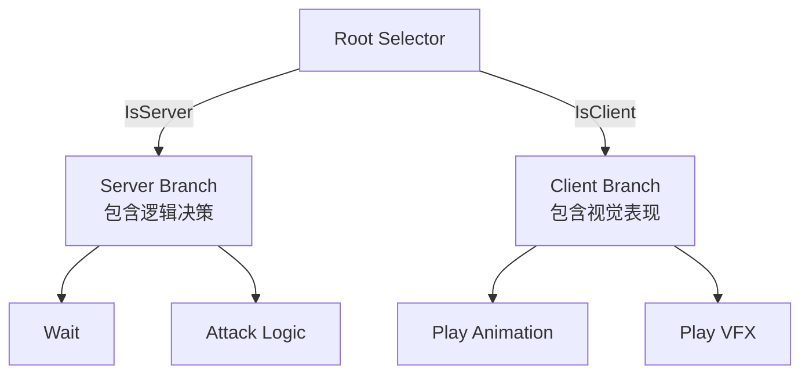

## 问题背景 (Problem)

在“双世界”（Dual World）架构下，服务器和客户端虽然共享同一套代码库，但在行为表现上职责截然不同：

1. **Server**: 负责核心决策、状态变更、数值计算（如扣血、死亡判定）。
2. **Client**: 负责视觉表现、音效、动画播放、UI展示。

如果我们维护两套独立的行为树（`ServerTree` 和 `ClientTree`），会带来维护成本的倍增和逻辑不一致的风险。如果让客户端完全运行与服务器相同的逻辑，则不仅浪费性能，还会因为浮点数误差或时序差异导致“脑裂”（Split-Brain）和状态去同步。

如何在一个行为树资产中同时满足双端的不同需求，并保持严谨的服务器权威性？

## 之前的逻辑/备选方案 (Alternatives)

1. **完全分离**：制作 `Soldier_Server.asset` 和 `Soldier_Client.asset`。
    - *缺点*：修改一个逻辑（如增加“攻击”状态）需要修改两个文件，极易遗漏。
2. **完全镜像**：客户端跑完全一样的树，只在最后一步“造成伤害”时不执行。
    - *缺点*：客户端需要进行复杂的决策运算；容易出现客户端判定攻击了，但服务器判定没攻击（距离差一点点），导致客户端播放了攻击动作却没伤害，体验割裂。

## 解决方案 (Solution)

我们采用 **“同构树 + 根节点分流 + 黑板同步”** 的架构。

### 1. 根节点分流 (Root Selector)

整棵树的根节点是一个特殊的 Selector（选择器），它根据运行时 `Context.IsServer` 的值决定进入哪个分支：

- **Server Branch**: 包含完整的决策逻辑（AI 寻路、索敌、攻击判定）。这是“大脑”。
- **Client Branch**: 包含纯粹的表现逻辑（播放攻击动作、播放特效）。这是“躯干”。

### 2. 黑板同步 (Blackboard Synchronization)

客户端分支 **严禁** 进行任何独立决策（如“判断距离是否足够”）。它的运行完全依赖于 **黑板（Blackboard）** 中的数据，而这些数据是由服务器分支写入并同步过来的。

- **写入者**: Server Branch。例如，当服务器决定“攻击”时，它不仅执行攻击逻辑，还会修改黑板 Key `IsAttacking = true`，或 `ActionState = Attacking`。
- **同步机制**: 服务器每一帧（或按需）将黑板中标记为“需同步”的关键 Key（如状态、目标ID）发送给客户端。
- **读取者**: Client Branch。客户端节点（如 `CheckBlackboardCondition`）读取这些值。如果 `IsAttacking == true`，则进入播放攻击动作的节点。

### 3. 通信协议与时序

为了保证表现的平滑和正确：

1. **Key 命名约定**: 共享同一套 Key 定义（如 `BB_Key_TargetId`）。
2. **消息结构**:
    - `SyncBlackboardMessage`: 包含 `Dict<string, BBValue>`。
    - 建议携带 `Tick` 或 `Version`，防止乱序。
3. **插值与预测**: 对于位置信息，客户端依然使用平滑插值（View），而不是瞬间设置到行为树黑板的位置。

### 4. 架构优势

- **资产统一**：策划只需要在一个画布上工作，逻辑与表现的对应关系一目了然。
- **权威唯一**：客户端绝不做决策，只做“服务器的影分身”，彻底消除了逻辑去同步的风险。
- **调试便利**：在编辑器里可以同时观察 Server 和 Client 的黑板值，快速定位是“没同步过来”还是“没播放出来”。
- **所见即所得**：可以直接在行为树里挂载特效、音效节点，保持了架构的统一性。
