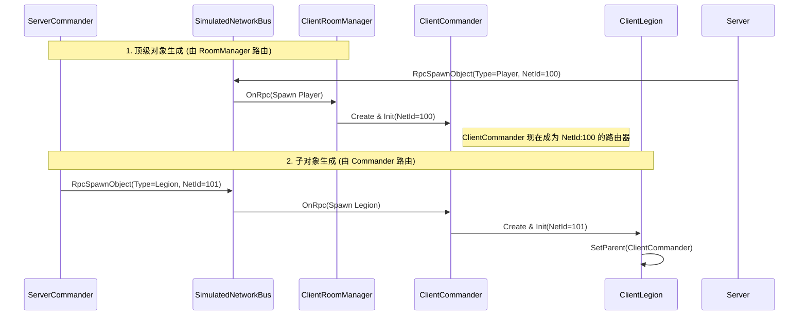

# 网络架构重构：集中式分发与指挥官层级

## 1. 背景 (Context)

在早期的开发阶段，我们的网络对象生成逻辑较为分散。`ClientRoomManager` 负责监听所有的网络生成事件，并尝试组装各种游戏对象。随着引入 SLG 玩法中的层级结构（Commander -> Legion -> Squad -> Unit），这种扁平化的生成方式暴露出了以下问题：

1. **监听器地狱 (Listener Hell)**: 每个网络对象都需要手动注册 RPC 监听器，且容易遗漏。
2. **层级混乱**: `ClientRoomManager` 需要手动维护 ID 映射来构建父子关系，逻辑复杂且脆弱。
3. **时序问题**: 无法保证父对象（如 Commander）在子对象（如 Legion）之前初始化完毕。

我们需要一种更健壮、符合 "Server-Authoritative" 且支持深层级对象生成的网络架构。

## 2. 架构决策 (Decision)

我们决定实施 **集中式分发 (Centralized Dispatch)** 和 **指挥官中心化生成 (Commander-Centric Spawning)** 模式。

### 2.1 集中式分发 (Centralized Dispatch)

引入 **路由器 (Router)** 概念。网络消息不再广播，而是由特定的“路由器”对象接收并分发。

- **根路由器 (`ClientRoomManager`)**:
  - 监听固定 ID (`ROOM_MANAGER_NET_ID`)。
  - **职责**: 仅负责处理顶级对象（如 `Player/Commander`）的生成。
  - 对于非顶级对象（如 `Legion`），它会忽略，交由下级路由器处理。

- **二级路由器 (`ClientCommander`)**:
  - 监听服务器分配给它的动态 NetId。
  - **职责**: 负责处理归属于它的子对象（如 `Legion`）的生成。

### 2.2 自动装配 (Auto-Wiring)

在 `SimulatedNetworkBus` 中增强了 `RegisterSpawns` 方法。

- **决策**: 当注册一个网络对象时，默认自动将其 `OnRpc` 方法注册为该 NetId 的监听器。
- **收益**: 开发者只需调用一次注册，即可确保对象能收到发往其 NetId 的所有消息，杜绝了手动注册遗漏的问题。

## 3. 细节与示例 (Details)

### 3.1 核心流程时序



### 3.2 代码变更关键点

**ClientRoomManager.cs**:

```csharp
public override void OnRpc(IRpc rpc)
{
    if (rpc is RpcSpawnObject spawnMsg && spawnMsg.Type == NetworkPrefabType.Player)
    {
        // 只处理 Commander 生成
        OnSpawnObject(spawnMsg);
    }
    // 忽略 Legion/Squad，它们由 ClientCommander 处理
}
```

**ClientCommander.cs**:

```csharp
public override void OnRpc(IRpc rpc)
{
    if (rpc is RpcSpawnObject spawnMsg && spawnMsg.Type == NetworkPrefabType.Legion)
    {
        // 收到发给自己的消息，要求生成下属 Legion
        var legion = _legionFactory.Create();
        // ... 初始化并注册 ...
    }
}
```

## 4. 总结 (Summary)

本次重构通过将网络消息分发权下放，构建了清晰的 **Server -> Client Router -> Sub-Router** 的层级结构。这不仅解决了代码耦合问题，还天然保证了 SLG 复杂的对象层级关系在网络同步中的正确性。
