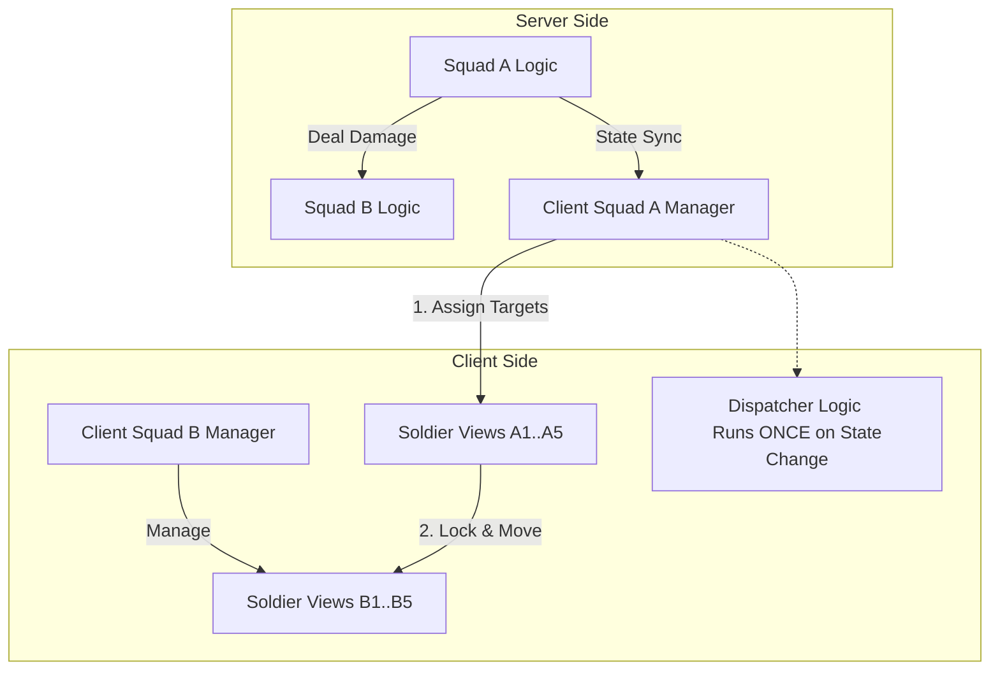

## 1. 问题背景 (Problem Background)

在《无尽冬日》(Whiteout Survival) 及类似的千人同屏 SLG 游戏中，战斗画面往往表现得非常细致：

- **独立的士兵行为**：每个小兵似乎都有自己的“思想”，会锁敌、冲锋、攻击特定的敌人。
- **高拟真度**：前排士兵会优先寻找最近的敌方单位进行厮杀，而非对着空气挥砍。

然而，如果在技术实现上真为每个士兵（例如双方各 10,000 单位）都分配独立的 AI 行为树（寻路、索敌、决策），将面临巨大的性能瓶颈：

1. **CPU 算力爆炸**：每帧更新数万个 Agent 的行为逻辑在移动端是不现实的。
2. **网络同步困难**：如果要同步每个士兵的位置和状态，带宽消耗将无法承受。

因此，我们需要一种架构，既能保持宏观战斗逻辑的简洁与高性能，又能呈现微观士兵战斗的高拟真度。

## 2. 之前的逻辑与误区 (Previous Logic & Misconception)

初期的直觉设计往往是：

- **误区**：认为“小兵独立锁敌”意味着行为树 (Behavior Tree) 挂在每个小兵身上。
- **误区**：认为服务器需要知道每个小兵的位置，以便进行精确判定。

这种设计违背了 **“逻辑与表现分离” (Logic-View Separation)** 的原则，导致服务器负载过重且客户端优化困难。

## 3. 解决方案：中央分配器与表现层代理 (Proposed Solution)

采用 **“军团级逻辑 + 表现层目标分配”** 的架构。

### 3.1 核心原则

1. **服务器权威 (Server Authoritative) - 只有军团 (Squad)**
    - 服务器只维护 **Squad (方阵/军团)** 级别的对象。
    - 战斗计算是抽象的：Squad A 每回合对 Squad B 造成 1000 点伤害。
    - 服务器**完全不知道**小兵的存在，也不关心它们的位置。

2. **客户端表现 (Client Visual) - 视觉代理 (Visual Proxy)**
    - 客户端为了“圆谎”，根据 Squad 的状态生成 N 个 **Soldier View**（视觉小兵）。
    - 这些小兵没有大脑，只有“指令接收器”。

### 3.2 关键机制：拉郎配 (The Pairing Algorithm)

为了实现“看似独立智能”的效果，我们在客户端 Squad View 层实现一个 **中央分配器 (Central Dispatcher)**。

**流程如下：**

1. **状态同步**：服务器通知客户端 `Squad A` 进入 `Attack` 状态，目标是 `Squad B`。
2. **目标分配 (The Pairing)**：
    - 客户端 `Squad A View` 遍历自己麾下的所有可视小兵。
    - 获取敌方 `Squad B View` 麾下的所有可视小兵。
    - 运行一个轻量级算法（如就近原则或随机槽位匹配），给每个 `Soldier A` 指定一个具体的 `Soldier B` 作为 `LockTarget`。
3. **伪 AI 执行**：
    - `Soldier A` 收到指令：“去砍 `Soldier B`”。
    - `Soldier A` 执行极简逻辑：`MoveTo(B.Position)` -> `PlayAnim("Attack")`。
    - 配合受击：当 A 播放攻击关键帧时，直接通知 B 播放受击，确保视觉同步。

### 3.3 架构图解

## 4. 优势 (Benefits)

1. **极高性能**：逻辑层复杂度为 O(SquadCount)，与士兵数量无关。
2. **表现力强**：通过客户端的“拉郎配”，实现了刀刀入肉的视觉效果，避免了“打空气”。
3. **开发解耦**：
    - 服务器专注于数值验证和胜负判定。
    - 客户端专注于动作融合、特效和打击感，双方互不干扰。

## 5. 结论 (Conclusion)

所有的“士兵独立AI”在 SLG 大战场中都是**视觉欺骗**。
真正的行为树只存在于 **Squad** 级别。小兵只是表现层的一个 **View Component**，其行为完全由上层 Squad Manager 进行**确定性分配**。
