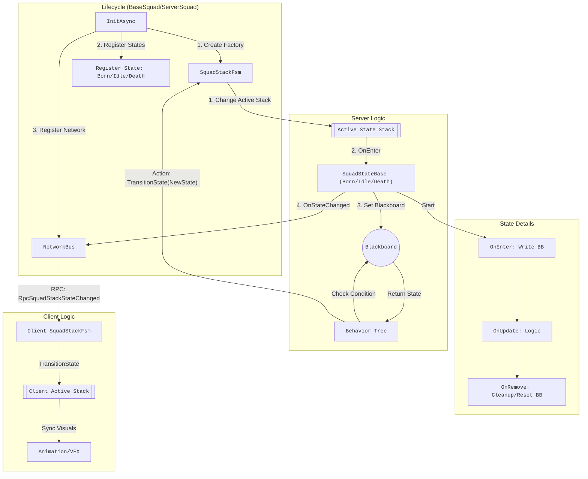

# Squad 行为树与栈式 FSM 架构设计

本文档详细描述了当前 Squad (方阵)、栈动画状态机 (Stack FSM) 与行为树 (Behavior Tree) 的协同工作框架、设计规则及注意事项。

## 1. 框架组成与职责

### 1.1 BaseSquad / ServerSquad / ClientSquad

**生命周期入口与承载容器**

- **初始化状态机**: 在 `TryInitStackFsm` 中负责创建 FSM 并注册所有可用状态（Born, Idle, Death 等）。
- **网络同步**:
  - **服务端**: 订阅 `SquadStackFsm.OnStateChanged` 事件，当状态变更时发送 RPC 通知客户端。
  - **客户端**: 接收 RPC 消息，通过 `TransitionState` 方法同步本地 FSM 状态，确保表现层一致。

### 1.2 SquadStackFsm

**核心栈式状态机**

- **栈式管理**: 支持多个状态压栈，但**当前仅栈顶状态运行**。
- **优先级机制**: 状态由枚举值区分 ID，内部需维护一套优先级映射（或通过枚举值大小）。只有高优先级状态能打断低优先级；移除栈顶后，次高优先级状态自动恢复运行。
- **生命周期管理**:
  - `TransitionState`: 切换/压入新状态。
  - `RemoveState`: 移除指定状态。
  - `ClearStates(bool)`: 清理活动栈。参数决定是否同时清空已注册的状态表（Registry）。
- **事件广播**: `OnStateChanged` 对外通知当前栈顶状态的变化。
- **前置条件**: 状态必须先注册（Register）才能使用。

### 1.3 SquadStateBase 及子类 (Born/Idle/Death)

**具体状态定义**

- **状态行为**:
  - `OnEnter`: 默认将自身的 `StateId` 写入黑板 Key `BuffBindAnimStackState`。这是 FSM 驱动行为树的关键。
  - `OnRemove`: 默认仅打印日志。
- **Death 特殊处理**:
  - 当前作为状态流转的落点。
  - 移除时（OnRemove）负责将黑板重置为 `NullStateID` (在子类实现)，避免黑板残留脏数据。

### 1.4 行为树 (Behavior Tree)

**逻辑驱动层**

- **黑板驱动**: 通过判断黑板键 `BuffBindAnimStackState` 的值来决定走哪个分支（Born / Idle / Death）。
- **反向控制**: 行为树节点（Action Node）调用 `NP_ChangeSquadStackStateAction`、`NP_RemoveSquadStackStateAction` 或 `NP_ClearSquadStackStateAction` 来触发 FSM 的状态变更。
- **节奏控制**: 利用 Log、Wait 等节点控制业务逻辑的执行节奏（如播放出生动画等待 0.5s）。

## 1.5 协同工作流程图 (Collaboration Flowchart)

## 2. 设计规则

1. **黑板单一判定源**:
    - 状态进入时（OnEnter）必须由状态类自行写入黑板。
    - 避免在行为树 Action 或其他外部逻辑中重复写入同一个黑板键，确保 FSM 是黑板该 Key 的唯一权威写入者。

2. **注册机制**:
    - 凡是可能用到的状态，必须在初始化阶段（InitAsync）注册到 FSM。
    - 若调用 `ClearStates(true)` 清空了注册表，必须重新注册才能再次切换状态。

3. **栈顶运行原则**:
    - 系统时刻维护一个状态栈，但只有位于栈顶的状态会执行逻辑（OnUpdate 等）。
    - 遵循高优打断低优、移除后恢复下层状态的 LIFO (Last In First Out) 或 优先级队列规则。

4. **权威服务器模型**:
    - 客户端和服务端都运行 FSM 实例。
    - **服务端**推演逻辑并拥有最终解释权，通过 RPC 下发状态变更指令。
    - **客户端**收到指令后，执行同样的 `TransitionState` / `RemoveState` 逻辑以同步表现。

5. **清理策略**:
    - `ClearStates(false)`: 仅清空当前活动的状态栈（Active Stack），**保留**注册表（Registry）。适用于复活、重置战斗等对象复用场景。
    - `ClearStates(true)`: 彻底清空，包括注册表。适用于对象销毁（Destroy）。
    - **Death 流程**: 当前设计中，Death 状态本身不主动清理自己。清理工作（Remove/Clear）由行为树的 Death 分支在执行完相关逻辑（如死亡表现）后，通过 Action 节点触发。

## 3. 后续展开注意事项

1. **死亡表现与清理时机**:
    - 若需要播放死亡动画或处理死亡事件，**切勿**在 `Death.OnEnter` 时立即清理状态或将黑板回写为 Null。
    - 应让 Death 状态保持一段时间，由行为树控制 `Wait`，待表现结束后再执行清理节点。

2. **引入新状态**:
    - **C#**: 定义新状态类继承 `SquadStateBase`，实现 `OnEnter`（写黑板）和 `OnRemove`（必要时回写）。
    - **FSM**: 确保在 Squad 初始化时注册该新状态。
    - **BT**: 在行为树中使用对应的枚举值作为判断条件。

3. **对象池 (Object Pooling)**:
    - 在回收对象（Push to Pool）前，应根据需求选择清理策略。通常建议保留注册表（便于下次 Pop 时直接用），仅清空活动栈。

4. **RPC 同步**:
    - RPC 同步依赖于 `OnStateChanged` 触发瞬间的 `CurrentState`。
    - 务必避免在同一帧内发生 "Enter State A -> Clear -> Enter State Null" 的快速抖动，这可能导致网络端只能收到 Null 而丢失 State A 的关键信息。
